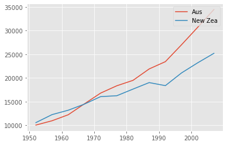

# Graphics and Plotting

There are many plotting libraries in python, one popular one is `matplotlib`.


```python
%matplotlib inline
import matplotlib.pyplot as plt
import pandas as pd
```


```python
data = pd.read_csv("data/gapminder_gdp_oceania.csv", 
                   index_col= 'country')
data
```


<div>
<style scoped>
    .dataframe tbody tr th:only-of-type {
        vertical-align: middle;
    }

    .dataframe tbody tr th {
        vertical-align: top;
    }

    .dataframe thead th {
        text-align: right;
    }
</style>
<table border="1" class="dataframe">
  <thead>
    <tr style="text-align: right;">
      <th></th>
      <th>gdpPercap_1952</th>
      <th>gdpPercap_1957</th>
      <th>gdpPercap_1962</th>
      <th>gdpPercap_1967</th>
      <th>gdpPercap_1972</th>
      <th>gdpPercap_1977</th>
      <th>gdpPercap_1982</th>
      <th>gdpPercap_1987</th>
      <th>gdpPercap_1992</th>
      <th>gdpPercap_1997</th>
      <th>gdpPercap_2002</th>
      <th>gdpPercap_2007</th>
    </tr>
    <tr>
      <th>country</th>
      <th></th>
      <th></th>
      <th></th>
      <th></th>
      <th></th>
      <th></th>
      <th></th>
      <th></th>
      <th></th>
      <th></th>
      <th></th>
      <th></th>
    </tr>
  </thead>
  <tbody>
    <tr>
      <th>Australia</th>
      <td>10039.59564</td>
      <td>10949.64959</td>
      <td>12217.22686</td>
      <td>14526.12465</td>
      <td>16788.62948</td>
      <td>18334.19751</td>
      <td>19477.00928</td>
      <td>21888.88903</td>
      <td>23424.76683</td>
      <td>26997.93657</td>
      <td>30687.75473</td>
      <td>34435.36744</td>
    </tr>
    <tr>
      <th>New Zealand</th>
      <td>10556.57566</td>
      <td>12247.39532</td>
      <td>13175.67800</td>
      <td>14463.91893</td>
      <td>16046.03728</td>
      <td>16233.71770</td>
      <td>17632.41040</td>
      <td>19007.19129</td>
      <td>18363.32494</td>
      <td>21050.41377</td>
      <td>23189.80135</td>
      <td>25185.00911</td>
    </tr>
  </tbody>
</table>
</div>


```python
data.iloc[0,:]
```


    gdpPercap_1952    10039.59564
    gdpPercap_1957    10949.64959
    gdpPercap_1962    12217.22686
    gdpPercap_1967    14526.12465
    gdpPercap_1972    16788.62948
    gdpPercap_1977    18334.19751
    gdpPercap_1982    19477.00928
    gdpPercap_1987    21888.88903
    gdpPercap_1992    23424.76683
    gdpPercap_1997    26997.93657
    gdpPercap_2002    30687.75473
    gdpPercap_2007    34435.36744
    Name: Australia, dtype: float64


```python
plt.plot(data.iloc[0,:])     # need to either switch xy or rotate x axis
```


    [<matplotlib.lines.Line2D at 0x7f9bb31bd690>]


    

    


Convert column names from "gdpPercap_YYYY" to just the year. 


```python
data.columns = data.columns.str.strip('gdpPercap_').astype(int)
data
```


<div>
<style scoped>
    .dataframe tbody tr th:only-of-type {
        vertical-align: middle;
    }

    .dataframe tbody tr th {
        vertical-align: top;
    }

    .dataframe thead th {
        text-align: right;
    }
</style>
<table border="1" class="dataframe">
  <thead>
    <tr style="text-align: right;">
      <th></th>
      <th>1952</th>
      <th>1957</th>
      <th>1962</th>
      <th>1967</th>
      <th>1972</th>
      <th>1977</th>
      <th>1982</th>
      <th>1987</th>
      <th>1992</th>
      <th>1997</th>
      <th>2002</th>
      <th>2007</th>
    </tr>
    <tr>
      <th>country</th>
      <th></th>
      <th></th>
      <th></th>
      <th></th>
      <th></th>
      <th></th>
      <th></th>
      <th></th>
      <th></th>
      <th></th>
      <th></th>
      <th></th>
    </tr>
  </thead>
  <tbody>
    <tr>
      <th>Australia</th>
      <td>10039.59564</td>
      <td>10949.64959</td>
      <td>12217.22686</td>
      <td>14526.12465</td>
      <td>16788.62948</td>
      <td>18334.19751</td>
      <td>19477.00928</td>
      <td>21888.88903</td>
      <td>23424.76683</td>
      <td>26997.93657</td>
      <td>30687.75473</td>
      <td>34435.36744</td>
    </tr>
    <tr>
      <th>New Zealand</th>
      <td>10556.57566</td>
      <td>12247.39532</td>
      <td>13175.67800</td>
      <td>14463.91893</td>
      <td>16046.03728</td>
      <td>16233.71770</td>
      <td>17632.41040</td>
      <td>19007.19129</td>
      <td>18363.32494</td>
      <td>21050.41377</td>
      <td>23189.80135</td>
      <td>25185.00911</td>
    </tr>
  </tbody>
</table>
</div>


Better plot.


```python
data.loc['Australia'].plot()    #<= internal data.frame connection to matplotlib

```


    <AxesSubplot:>


    

    


```python
data.plot()
```


    <AxesSubplot:xlabel='country'>


    

    


Python plots assume

* rows = x axis
* cols = y axis


```python
data.T.plot()  # need to transpose the row <-> col
```


    <AxesSubplot:>


    

    


```python
plt.style.use('ggplot')        # Style changes (search for other styles)
data.T.plot()
```


    <AxesSubplot:>


    

    


```python
data.T.plot(kind='bar')      # pick a geom, similar to to geom_bar
```


    <AxesSubplot:>


    

    


```python
plt.plot(data.columns, data.loc['Australia'])    # Assigning x y axis directly
```


    [<matplotlib.lines.Line2D at 0x7f9bb3991b50>]


    

    


```python
plt.plot(data.columns, data.loc['Australia'], label="Aus")
plt.plot(data.columns, data.loc['New Zealand'], label="New Zea")
plt.legend(loc = "upper right")
```


    <matplotlib.legend.Legend at 0x7f9bb3a99390>


    

    


```python
plt.scatter(data.loc['Australia'], 
            data.loc['New Zealand'])
```


    <matplotlib.collections.PathCollection at 0x7f9bb3bb1690>


    

    


```python
data.T.plot.scatter(x = 'Australia', y='New Zealand')   #<= easier to remember from ggplot2 world
```


    <AxesSubplot:xlabel='Australia', ylabel='New Zealand'>


    

    


```python
data.T.plot()
plt.savefig("GDP.png")
```


    

    


```python

```


```python

```
